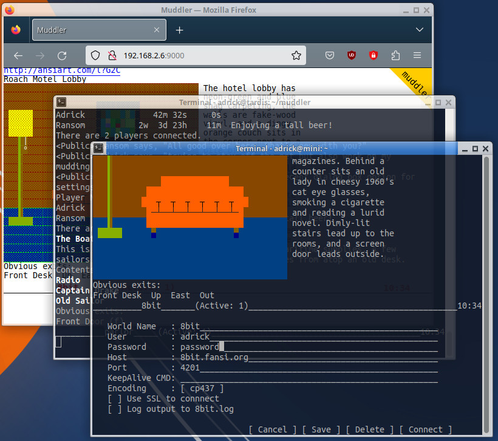

This screenshot shows the two interfaces of muddler. In the foreground is muddler running in a terminal window. The background window is firefox connected to the same muddler session via websockets. Both are interactive and can show the same or different worlds.

# muddler

   A perl based mudding reminiscent of TinyFugue with a few twists. 

# Features
```
   o Console support - Mudding via your favorite terminal
   o websocket support - Think mudding via your browser
        dark / light theme / mobile interface supported
   o Tinyfugue like command support.
   o SSL support when connect to worlds or via the browser
   o 256 color, UTF8, fansi, latin encoding support 
   o Connect to multiple worlds at the same time
   o More / pausing output control by tab character
   o History buffer via page up/down or /recall
   o keep-a-live to prevent disconnects
   o Activity notifications
   o /update pulls the most current version of muddler from github
     and loads it without restarting (usually).
   o Spell checking
       Mispelled words will be shown as bold in the terminal.
       Suggestions can be listed and cycled through with Esc-Q.
       The web interface will show a red squiggly underline for
       misspelled words (dependant upon browser).
   o Multiple Window Support - Fire up multiple browser windows or terminals
       as needed. Each window has its own focus independant of other windows.

```
# muddler goals
```
   o Go for Simplicity.
   o Allow users to switch between computers with ease. The main muddler
     process still needs to run a particular server but viewing can be
     switched from computer to computer.
   o Make a rich and full featured web interface
   o Support a "language" either tinyfugue like or maybe mush?
     (mush is just an easy answer since i've already written a mush in perl)
```
# Installation
```
   a. download muddler script
   b. chmod u+x muddler
   c. Install required perl modules manually. Muddler will tell you wich
      modules are missing.

         or 

      ./muddler --install

         This will install missing modules and/or install the modules from
         cpan. Currently this only works on linux systems supporting apt.

   d. ./muddler <options>

   Options:
      --noconsole        : disable the text based console and enable the
                           web/websocket server.
      --password         : specify the password for the websocket interface.
      --port             : specify the port for the web server. The websocket
                           server will be one port number higher.
      --remote=host:port : Specify the remote muddler websocket host/port
                           to connect to.
```
# Quick Start
   
```
   Basic Commands:
      /add [-s] <world> [<user> <password] <address> <port>
         Define a world so that muddler can connect with it. If a user and
         password are supplied, the user will be logged into at startup
         Using the -s option will use an ssl connection
      /world <world>
         Connect to an already defined world or switch to that world if
         the world has already ben opened. This can be done with the up/down
         arrow keys or escape-w.
      /help [<command>]
         Lists all commands or provides help on an individual command.
      /quit
         Had enough, quit muddler.
      /set encode = fansi | utf8 | latin
         Enable either fansi, utf8, or latin encoding for the current world.

   Web Commands:
      /web
         Show the status variables for the web server
      /web [on|off]
         Turn the web interace "on" or "off". Default is off.
      /set cert = <file>
         Specify your public certificate file for https.
      /set key = <file>
         Specify your private key file for https [non-self signed required]
      /set password = <password>
         Sets the password that must be entered when connecting vai the web.
      /set port = <port>
         This command sets the port that muddler will use when you connect
         to muddler via your browser. Just type in http://localhost:<port>
         to connect. The default port is port 9000.

         Note: If you plan to connect outside your network to muddler, the
               program uses <port> for web traffic and <port> + 1 for web-
               sockets. i.e. /port 9000 would use ports 9000 and 9001.

   Command Line:
      ./muddler <options>

          --noconsole     : disable the text based console and enable the
                            web/websocket server.
          --password      : specify the password for the websocket interface.
          --port          : specify the port for the web server. The websocket
                            server will be one port number higher.
   Saving stuff:
      muddler saves your data automatically. This is only pointed out because
      programs like TinyFugue require you to issue a command.

   Supported Keys:

      Keys     DESCRIPTION
      Ctl-A  | Move the cursor to the begining of the line
      Ctl-E  | Move the cursor to the end of the line
      Ctl-L  | Erases the screen and redraws it
      Ctl-N  | Moves forward one entry in the keyboard history.
      Ctl-P  | Moves back one entry in the keyboard history.
      Ctl-R  | Reloads the code for muddler if there are any changes
      Ctl-U  | Clears the keyboard input
      Ctl-W  | Delete the last word before the cursor
      Down   | Switch to world with activity, or cycle down through worlds.
      Esc-J  | Skip to the end of any "mored" output.
      Esc-Q  | Show spell suggestions for last word. Cycle thru on next esc-q
      Esc-W  | Go to the next active world, or the last world
      Pgdn   | Moves forward in the history of the current world
      Pgup   | Moves back into the history of the current world
      Tab    | Moves forward a screen full when more is enabled/triggered.
      Up     | Switch to world with activity, or cycle up through worlds.

```
# TinyFugue info/differences
```
   If you wish to use your TinyFugue world file, just rename it to ~/.tfworlds.
   This file will be read on startup as long as there is not a .muddler file
   to read. The TinyFugue world file will not be modified by muddler.

   Saving stuff? TinyFugue requires you to do a /saveworld as needed.
   Muddler automatically saves data as needed to its .muddler file.
